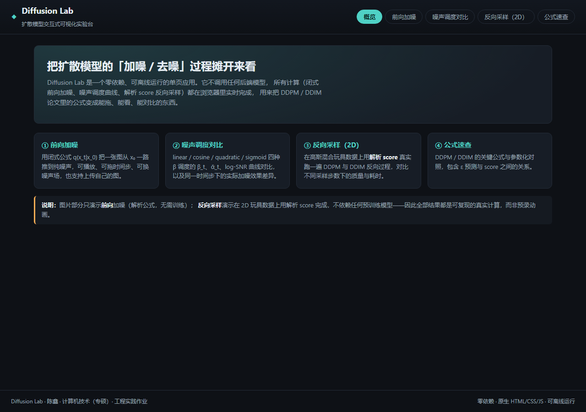
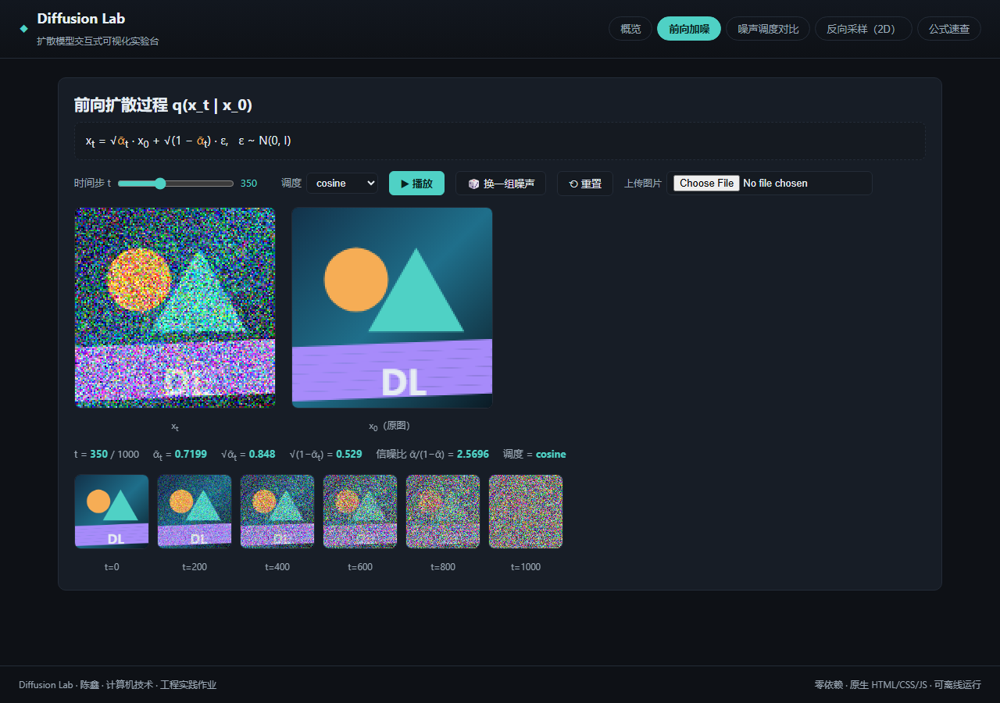
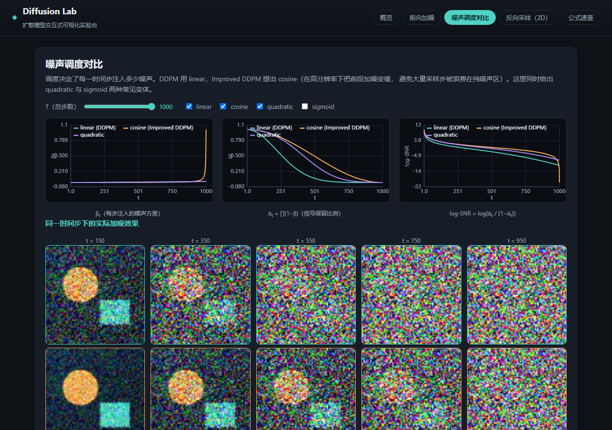
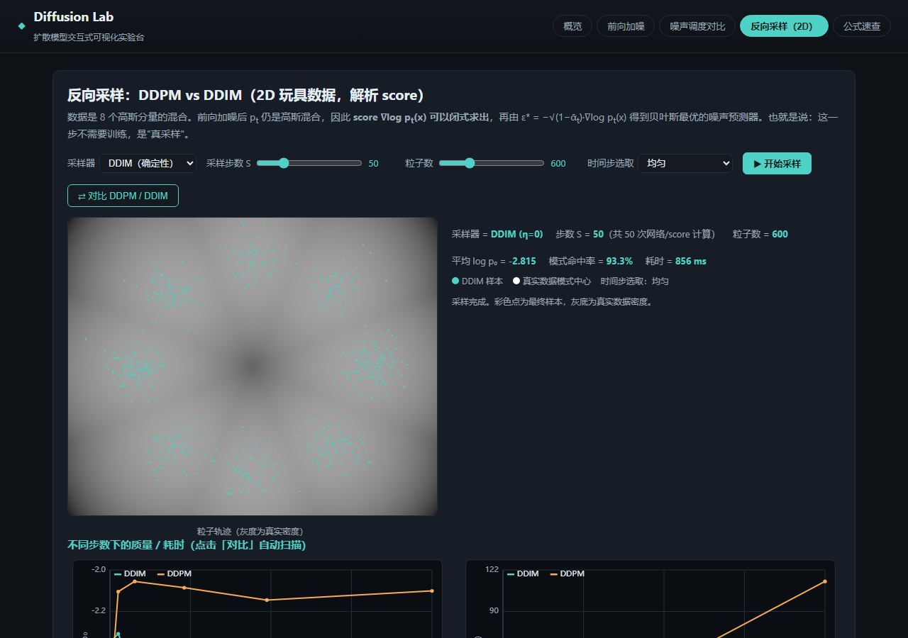
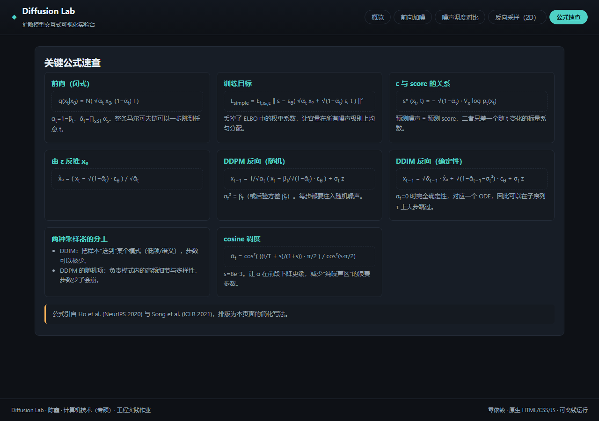

# 工程实践 · Diffusion Lab（扩散模型交互式可视化实验台）

一个**零依赖、可离线运行**的单页 Web 应用，把扩散模型（DDPM / DDIM）里最核心的三个机制——
闭式前向加噪、噪声调度、反向采样——做成可以拖动、播放、对比的交互界面。

> 所有计算都在浏览器里实时完成：图片加噪用的是解析公式，
> 2D 反向采样用的是**解析 score**（不需要任何预训练模型），
> 因此页面上的每一条曲线、每一次采样都是真实计算的结果，不是预录动画。

**工程项目部署链接**：<https://grad-prep-chenxin.vercel.app>

## 快速开始

```bash
# 方式一：在线访问（Vercel 静态托管，无需任何配置）
https://grad-prep-chenxin.vercel.app

# 方式二：直接双击打开（无需构建、无外部依赖）
engineering/src/index.html

# 方式三：本地起个静态服务器（推荐，体验一致）
cd engineering/src
python -m http.server 8080
# 浏览器访问 http://127.0.0.1:8080
```

- 无需安装任何 npm 包 / Python 包，浏览器打开即用。
- 推荐使用近两年的 Chrome / Edge / Firefox。

## 功能总览

| 模块 | 内容 | 涉及的知识点 |
|------|------|-------------|
| ① 前向加噪 | 把一张图（内置示例图或自己上传）从 x₀ 逐步推到纯噪声；可拖时间步、可播放、可换噪声场；实时显示 ᾱ_t、√(1−ᾱ_t)、信噪比 | 闭式公式 q(x_t\|x₀)（DDPM 论文 Eq.4 的性质） |
| ② 噪声调度对比 | linear / cosine / quadratic / sigmoid 四种 β 调度的 β_t、ᾱ_t、log-SNR 曲线；同一时间步下各调度的实际加噪效果对比 | 调度设计（DDPM 原文 vs Improved DDPM 的 cosine 调度） |
| ③ 反向采样（2D） | 在 8 高斯混合玩具数据上，用解析 score 代替 ε_θ，真实运行 DDPM（随机）与 DDIM（确定性）反向过程；可视化粒子轨迹；支持均匀 / log-SNR 等分两种时间步选取 | score 与 ε 的关系、DDIM 论文 Eq.12 的统一采样式、子序列跳步 |
| ④ 公式速查 | DDPM / DDIM 关键公式与两种采样器的分工总结 | — |

### 反向采样模块的原理（为什么不需要训练）

数据 p₀ 是 K 个各向同性高斯分量的混合，前向加噪是线性高斯的，因此
p_t 仍是高斯混合，score 可以**闭式求出**：

```
p_t(x) = Σ_k π_k · N(x; √ᾱ_t·μ_k, (ᾱ_t·σ² + 1 − ᾱ_t)·I)
ε*(x,t) = −√(1−ᾱ_t) · ∇log p_t(x)
```

把解析最优的 ε* 代入 DDPM / DDIM 的反向公式，就等价于"训练到收敛的模型"在采样。
这使得不同采样器、不同步数的差异可以被**干净地观察**（同一数据、同一起点噪声）。

页面内置了一个真实指标：采样结束后计算所有粒子的**平均 log p₀**（在真实混合高斯下的对数似然，
越高越好）与**模式命中率**（落在任一模心 3σ 内的粒子占比）。

### 一个实际能观察到的现象

点击「⇄ 对比 DDPM / DDIM」，页面会扫描 S ∈ {5, 10, 20, 50, 100, 200}：

- **DDIM（确定性）**：S=20 时质量就基本稳定，对数似然几乎不再随 S 下降；
- **DDPM（随机）**：S<20 时质量明显崩坏——因为大步长下每步注入的随机噪声无法被纠回来；
- 两者耗时都近似随 S 线性增长。

这正是 DDIM 论文（ICLR 2021）的核心论点，可以在这个页面里亲手复现出来。

## 技术栈

| 层 | 选择 | 说明 |
|----|------|------|
| 语言 | 原生 HTML5 + CSS3 + JavaScript (ES2020) | 零框架、零依赖，突出工程基本功 |
| 计算 | TypedArray (Float32/Float64) + Canvas 2D | 前向加噪按像素闭式计算；2D 采样支持 2000 粒子 × 200 步实时动画 |
| 图表 | 自绘 Canvas 折线图（`js/charts.js`） | 坐标轴/网格/图例均为手写，约 150 行 |
| 工程化 | 模块化脚本（无构建步骤）+ 冒烟测试脚本 + 运行截图 | 见下 |

## 目录结构

```
engineering/
├── README.md            ← 你在这里
├── src/
│   ├── index.html       页面结构（5 个视图）
│   ├── styles.css       主题与布局
│   └── js/
│       ├── schedule.js  噪声调度（linear/cosine/quadratic/sigmoid）+ 随机工具
│       ├── charts.js    自绘 Canvas 折线图
│       ├── forward.js   前向加噪视图（闭式公式 + 上传图片）
│       ├── reverse.js   2D 扩散引擎（GMM、解析 score、DDPM/DDIM 统一采样式）
│       └── main.js      路由与各视图 UI 绑定
└── screenshots/         运行截图（由 Playwright 自动生成）
```

## 在线部署

**工程项目部署链接**：<https://grad-prep-chenxin.vercel.app>

部署平台 Vercel（静态托管，自动 HTTPS + 全球 CDN），配置要点：

| 配置项 | 值 |
|--------|----|
| Framework Preset | `Other` |
| Root Directory | `engineering/src`（仓库里还有 `research/`，必须限定根目录） |
| Build / Output / Install Command | 全部留空（纯静态，无构建步骤） |
| Production Branch | `main`（之后每次 push 自动重新部署） |

因为是零依赖纯静态站点，任意静态托管都能直接跑：Cloudflare Pages / Netlify 同样只需设 Root Directory。

## 运行截图

| | |
|---|---|
|  |  |
|  |  |
|  |  |

## 质量保证

- 用 Playwright 做了冒烟测试：加载页面、遍历全部 5 个视图、触发采样与 A/B 扫描、
  断言指标面板与对比表格内容，**控制台零报错**。
- 所有交互元素（滑块、下拉框、按钮、上传）均绑定真实逻辑，无装饰性假控件。
- 页面在断网环境下完整可用（无任何 CDN / 外部资源）。

## 已知限制（诚实说明）

1. 图片部分只演示**前向**加噪；真实图像的反向去噪需要训练好的 ε_θ 网络，浏览器端 CPU 无法胜任，因此没有做。
2. 2D 反向采样使用解析 score，反映的是"模型训练到最优"的理想情形；真实模型的误差会让少步数采样比这里表现更差。
3. 自绘折线图只实现了本页面需要的功能（无缩放、无 tooltip），不作为通用图表库使用。
