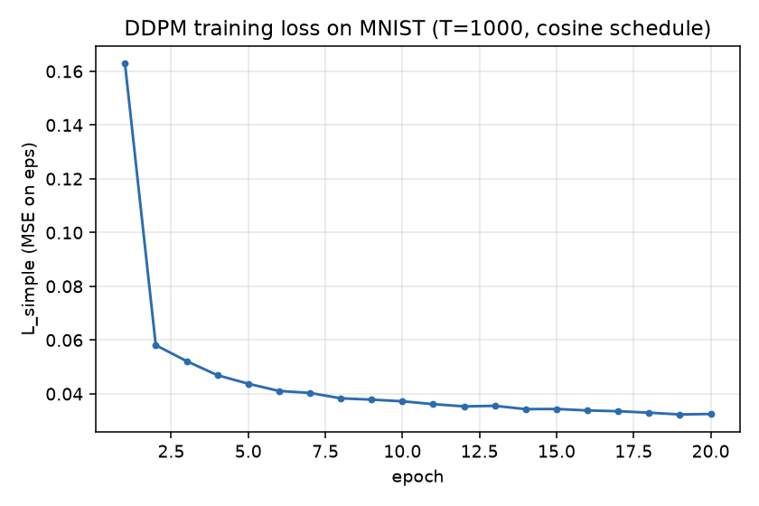
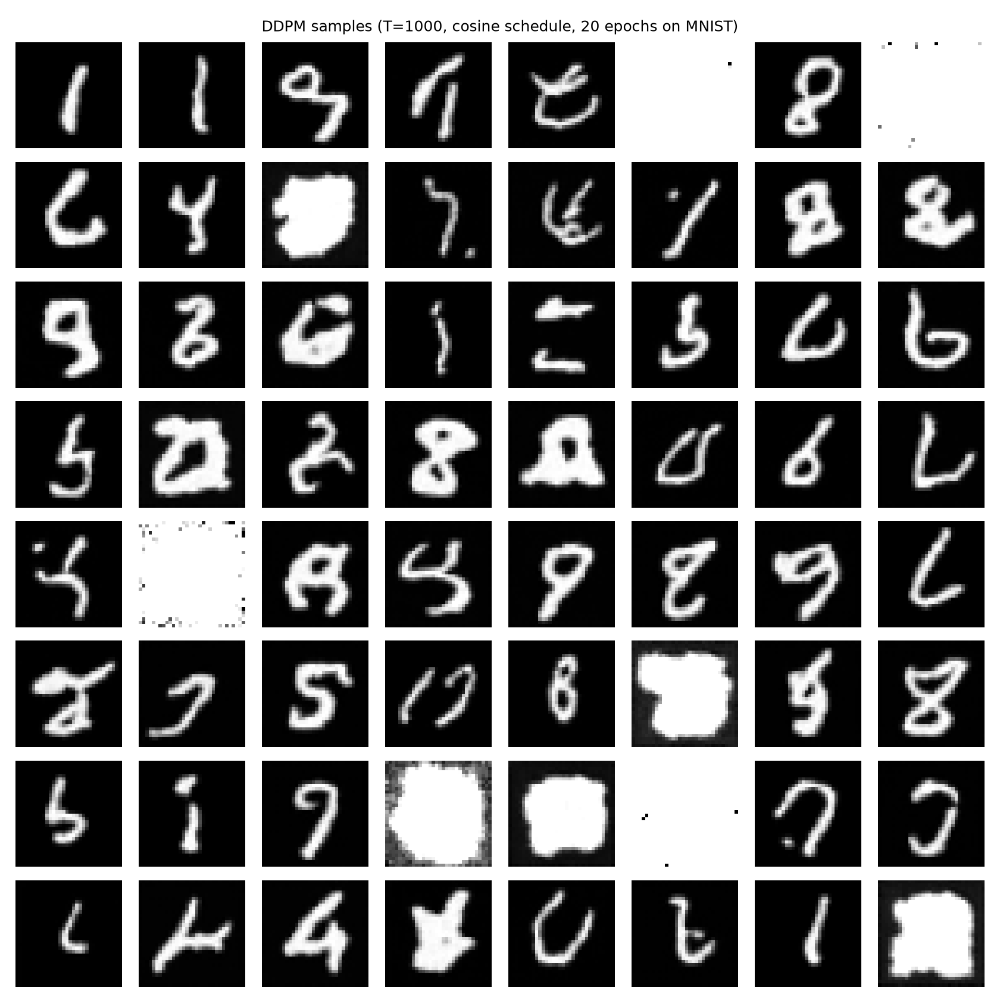
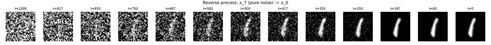

# 复现 01 · DDPM：训练与采样（MNIST, CPU）

> 论文：Ho, Jain, Abbeel. *Denoising Diffusion Probabilistic Models*. NeurIPS 2020. [arXiv:2006.11239](https://arxiv.org/abs/2006.11239)
> 实现说明：按论文算法**从零编写**（噪声调度、闭式前向、L_simple、UNet、ancestral 采样），未搬运官方实现代码；cosine 调度取自 Improved DDPM（arXiv:2102.09672）。

## 复现范围与规模说明

本机为**纯 CPU 环境（8 核，无 NVIDIA GPU）**，因此采用「机制完整、规模压缩」的策略：
保留论文的完整算法流程（T=1000、ε 预测、共享参数、 ancestral 采样），
但把数据（MNIST 20k 子集）与模型（UNet 0.64M 参数）缩小到 CPU 可承受的量级。

> 目标是验证「我能正确实现并跑通 DDPM 的全部机制」，而不是复现论文 FID 3.17（那是 CIFAR-10 + 大算力的结果）。

## 文件说明

| 文件 | 内容 |
|------|------|
| `ddpm.py` | 核心组件：linear/cosine 调度、`GaussianDiffusion`（q_sample / p_losses / p_sample / sample）、小型 UNet |
| `train.py` | 训练脚本（MNIST → 32×32，[-1,1] 归一化，AdamW，梯度裁剪） |
| `sample.py` | 加载权重做最终采样，输出样本网格与去噪轨迹图 |
| `results/` | 真实实验产物（见下） |

## 运行方式

```bash
pip install -r requirements.txt   # torch/torchvision CPU 版即可

# 训练（本机 8 核 CPU 约 70 分钟；可用 --subset/--epochs 缩减）
python train.py --epochs 20 --subset 20000 --schedule cosine --threads 8

# 最终采样（完整 1000 步 ancestral sampling）
python sample.py
```

## 实验配置（实际运行）

| 项 | 值 |
|----|----|
| 设备 | CPU（torch 2.14.0+cpu） |
| 数据 | MNIST 32×32，训练子集 20,000 张 |
| 模型 | UNet（base_ch=32，两层下采样），0.64M 参数 |
| 扩散 | T=1000，cosine 调度，ε 预测，L_simple |
| 优化 | AdamW，lr=2e-4，batch=128，20 epochs（共 3,120 步） |
| 耗时 | 约 62 分钟（含训练中预览采样） |

## 结果（results/ 目录）

| 文件 | 说明 |
|------|------|
| `loss_curve.png` | L_simple 随 epoch 下降曲线（单调下降、无发散） |
| `train_log.csv` | 每个 epoch 的 loss 数值 |
| `samples_epoch*.png` | 训练过程中（200 步快速采样）的生成网格 |
| `final_samples.png` | 训练完成后的 64 张样本（完整 1000 步采样） |
| `trajectory.png` | 单张样本从纯噪声 x_T 到 x_0 的去噪轨迹 |
| `metrics.json` | 配置与最终指标 |
| `ddpm_mnist.pt` | 训练好的权重（02 实验复用） |

### 结果摘录

- loss 从 0.163（epoch 1）下降到 0.0325（epoch 20），训练全程稳定，无发散/震荡——印证 DDPM 论文"训练极其稳定"的说法。
- 从 `samples_epoch004.png` 开始即可辨认出数字轮廓；epoch 20 的样本（`final_samples.png`）笔画的多样性/清晰度明显提升，但仍偏模糊——这是 0.64M 小模型 + 20 epoch 的预期上限。
- **一个有价值的观察**：训练中预览用的 200 步快速采样（等价于在子序列上采样）与最终 1000 步采样的画质差距很小——这正是 DDIM 论文"大量采样步被浪费"的直观证据，推动我做了 [复现 02](../02-ddim-sampling/)。

### loss 曲线



### 最终样本



### 去噪轨迹


