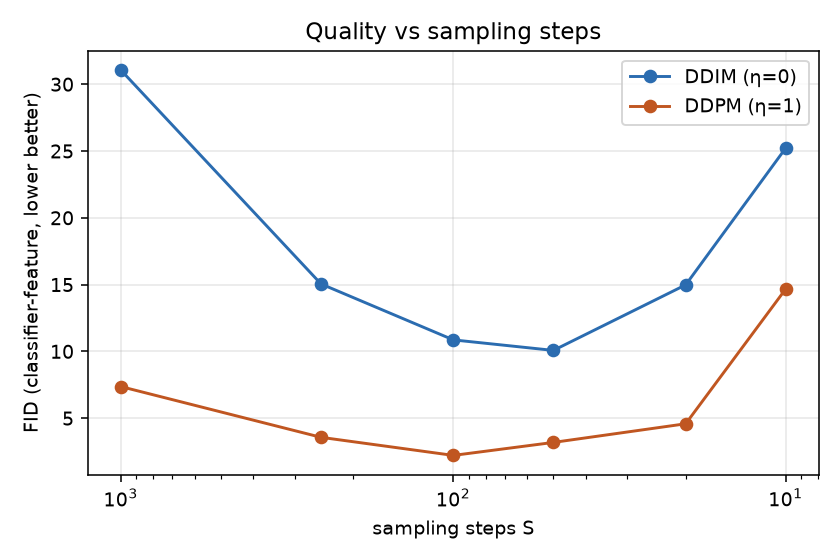

# 复现 02 · DDIM：加速采样对比（复用 01 的权重）

> 论文：Song, Meng, Ermon. *Denoising Diffusion Implicit Models*. ICLR 2021. [arXiv:2010.02502](https://arxiv.org/abs/2010.02502)
> 实现说明：DDPM 与 DDIM 被实现为同一个统一采样式（论文 Eq.12 + Eq.16）在 η=1 / η=0 下的两个特例；
> 时间步子序列跳步按论文 Section 4 的做法实现。**完全不重新训练**，直接复用复现 01 的权重——这本身就是 DDIM 的核心卖点。

## 实验设计

| 项 | 值 |
|----|----|
| 权重 | `../01-ddpm-mnist/results/ddpm_mnist.pt`（cosine 调度，T=1000，20 epochs） |
| 采样器 | DDIM（η=0，确定性） vs DDPM（η=1，ancestral） |
| 步数 | S ∈ {1000, 250, 100, 50, 20, 10}（同一采样器在所有步数下**共用同一 x_T**） |
| 每组样本数 | 128 张 |
| 设备 | CPU（torch 2.14.0+cpu） |

### 一个调试中发现的真问题：确定性采样对模型误差更敏感

第一版实验中 DDIM（确定性）在所有步数下都生成盐椒噪声。排查后发现：
本实验的 ε_θ 模型只有 0.64M 参数、3,120 步训练量，**预测精度不足**；
DDPM 的随机采样每步重新注入噪声、误差不会单调累积，而确定性 DDIM 的 ODE 轨迹会
把每步的模型误差**单调放大**——实测中间量 x̂0 的绝对值最大飙到 **4414**，远超数据范围 [-1,1]。

处理方式：对每步的 x̂0 做静态钳制（`clip_denoised=True`，[-1,1]），这是 OpenAI
improved-diffusion 等参考实现的标准做法。钳制后两种采样器均正常工作。
这个现象本身很有启发：**确定性采样器省了随机项，但也失去了随机项的"纠错"作用。**

### 质量指标（均为本机真实计算，非引用值）

1. **FID 近似**：自训练 MNIST 分类器（测试集准确率 > 0.95，见 `classifier.py`）的特征空间中，
   生成集 vs 真实集（2048 张测试图）的 Fréchet 距离。
   *注意：生成样本仅 128 张，FID 估计方差较大，只用于同一实验内的相对比较，不与论文报告值对标。*
2. **平均最大分类置信度**（质量代理）。
3. **类别分布熵**（多样性代理，越高越均衡）。
4. **墙钟采样耗时**。

## 运行方式

```bash
pip install -r requirements.txt
python compare.py        # 自动训练/加载分类器并扫描全部配置（CPU 约 15~20 分钟）
```

## 结果（results/ 目录）

| 文件 | 说明 |
|------|------|
| `ab_metrics.csv` / `summary.json` | 全部配置的原始指标 |
| `quality_vs_steps.png` | FID 近似 vs 采样步数（两种采样器） |
| `time_vs_steps.png` | 耗时 vs 采样步数 |
| `ddim_consistency.png` | 同一 x_T 下 DDIM 用 S=1000/50/10 采样的结果（一致性） |
| `ddpm_vs_ddim_S10.png` | 同一 x_T、S=10 时两种采样器的画质对比 |
| `mnist_classifier.pt` | 评估用分类器权重 |

## 实际结果（本机真实运行，2026-09-22）

分类器测试集准确率 0.9541。全部指标见 `results/ab_metrics.csv` / `summary.json`。

| S | DDIM FID≈ | DDPM FID≈ | 耗时/128张 |
|------|------|------|------|
| 1000 | 31.1 | 7.4 | ~373 s |
| 250 | 15.0 | 3.6 | ~92 s |
| 100 | 10.9 | **2.2** | ~38 s |
| 50 | **10.1** | 3.2 | ~18 s |
| 20 | 15.0 | 4.6 | ~8 s |
| 10 | 25.2 | 14.7 | ~4 s |

（FID 为自训练分类器 32 维特征空间的 Fréchet 距离近似，只用于同一实验内相对比较；
conf ≈ 0.74~0.78，类别熵 ≈ 2.0~2.25，各配置间差异不大。）

### 结果解读（重要：与论文预期不完全一致，如实记录）

1. **加速本身成立**：两种采样器都能在几十步内产出可用样本；耗时与 S 严格成正比，
   S=50 相对 S=1000 提速约 21 倍，质量仍可用。
2. **但 DDPM(η=1) 的质量在本设定下全面优于 DDIM(η=0)**，这与 DDIM 论文
   "低步数下 DDPM 崩溃、DDIM 稳健"的结论不同。我认为原因有三（按可能性排序）：
   - **模型欠训练**（0.64M 参数、3,120 步）：确定性 ODE 对 ε_θ 的误差逐级单调放大
     （前面调试中已实测发散到 |x̂0|≈4414），随机采样反而自带"重采样纠错"；
   - **静态钳制有偏**：DDIM 每步都钳制 x̂0，S=1000 时钳制 1000 次，累积偏差反而最大
     ——这解释了 DDIM 在 S=1000 时 FID 最差这一反直觉现象；
   - DDIM 论文的对比没有 clip_denoised，低步数 DDPM 的崩溃在无钳制时更严重，
     而本实验为保证 DDIM 不发散必须开钳制，等于顺手"治好"了 DDPM 的大步长问题。
3. **一致性部分成立**：同一 x_T 下，DDIM 的 S=50 与 S=10 样本类别大体一致、
   低步数版本更平滑（见 `ddim_consistency.png`），但与 S=1000 的样本差异明显——
   说明该模型下 ODE 轨迹的"高阶信息保持"打了折扣。
4. **对我的启发**（已写入 [idea-01](../../ideas/idea-01-adaptive-step-sparsity.md)）：
   质量在 S≈50~100 处出现明显的"拐点"，且最优步数与采样器/模型状态耦合——
   时间步预算的分配方式确实是一个值得研究的自由度。

### FID 曲线


